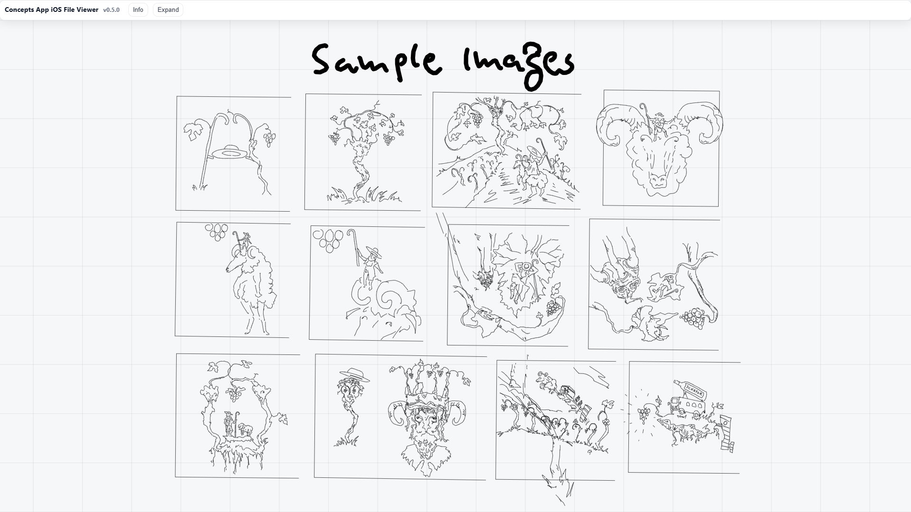

# ConceptsApp iOS WebViewer v0.4.7

> **Offline-first viewer for Concepts (`.concept`) files converted to JSON.**  
> v0.4.7 is a stable viewer release. Conversion from `.concept` → `.json` currently requires a small Python script.  
> v0.5 will add in-browser conversion (no Python needed).

<p align="center">
  
  
  
</p>
<p align="center">
  
  
  
</p>
<p align="center">
  
</p>

---

## ✨ Features (0.4.7)
- Single-file **HTML viewer** (no build, offline).
- Loads **`concepts.json`** + optional embedded **images/**.
- **Grid/Zoom/Center**, white-ink simulation, Dark/Light UI.
- **PNG / SVG export** of the canvas.
- Handles mirrors, basic auto-shapes, rough marker/airbrush (work-in-progress).
- Legal notice & about modal included.

> Note: Full in-browser conversion from `.concept` will arrive in **v0.5** (with optional vendor polyfills for decompression where needed).

---

## 🚀 Quick Start (Viewer only, no build)

1) **Open the viewer**  
- `viewer/ConceptsViewer_0.4.7.html` in your browser (double-click).  
  - Optional live demo via GitHub Pages:  
    `https://<GH_USER>.github.io/<REPO_NAME>/viewer/latest.html` *(replace with your user/repo)*

2) **Load data**  
- Click **JSON** → choose a `concepts.json`.  
- If your project has external images, click **Images → Pick** and multi-select the files (or select the whole `images/` folder if your browser allows).

3) **Navigate / Export**  
- Use zoom controls (or mouse wheel, if supported) and **Center** to focus the content.  
- **Export → PNG** or **Export → SVG** to save renders.

---

## 🧪 Try the Sample
- `samples/Demofile-3/Demofile-3.json` (ready to load)  
- Optional: open the matching `images/` and thumbnail if present.  
- The original `.concept` is included for comparison.

---

## 🔁 Convert `.concept` → `concepts.json` (Python)
Until v0.5, use the small converter script:

- File: `converter/conceptsapp_ios_to_json_v1_4_stable.py`  
- Usage: **Drag & drop** your `.concept` onto the script (or run with Python 3: `python conceptsapp_ios_to_json_v1_4_stable.py <file.concept>`).  
- Output:  
  - `<Name>/<Name>.json`  
  - `<Name>_thumb.jpg` (if present)  
  - `images/…` (extracted)

---

## 📂 Repository Layout
```
/
├─ viewer/
│  ├─ ConceptsViewer_0.4.7.html   # stable, single-file viewer
│  └─ latest.html                  # points to the latest stable viewer (optional)
├─ converter/
│  └─ conceptsapp_ios_to_json_v1_4_stable.py
├─ samples/
│  └─ Demofile-3/ ( .concept, .json, images/, thumb )
├─ assets/
│  └─ Screenshot_1.jpg … Screenshot_7.jpg
├─ README.md · CHANGELOG.md · LICENSE · NOTICE
```
---


## 🛣 Roadmap
- **0.5** – Fully in-browser converter (no Python), optional `vendor/` polyfills (e.g., decompression for Firefox).  
- **0.6** – Remove Python converter (deprecated), add more brush dynamics & auto-shapes.

---

## ⚠️ Known Limitations (0.4.7)
- Some advanced textured/pattern brushes not fully reproduced yet.  
- Auto-shapes & brush dynamics are partial; results may differ from Concepts.

---

## 📜 Legal
This project is an unofficial viewer for content created with **Concepts** (TopHatch, Inc.).  
All artwork and trademarks belong to their respective owners.

---

## 📦 License
MIT — see `LICENSE`.

---

## 🗒 Changelog
See `CHANGELOG.md` for details on v0.4.7 and prior iterations.
