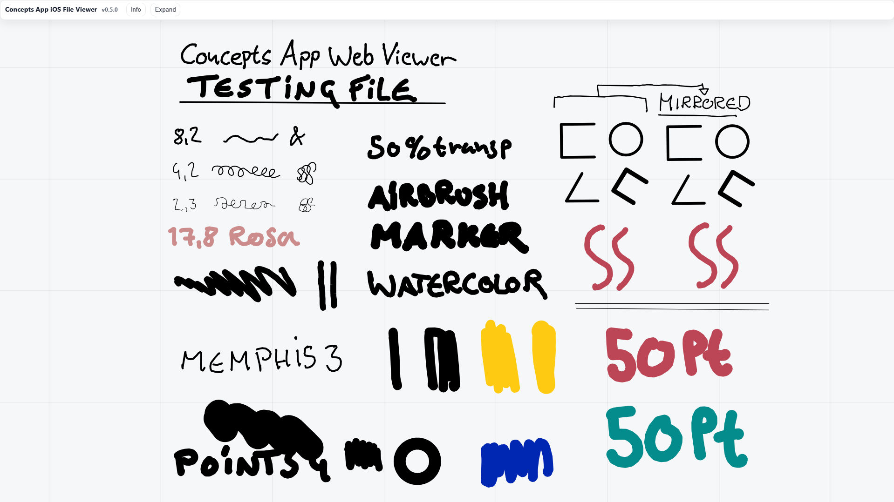
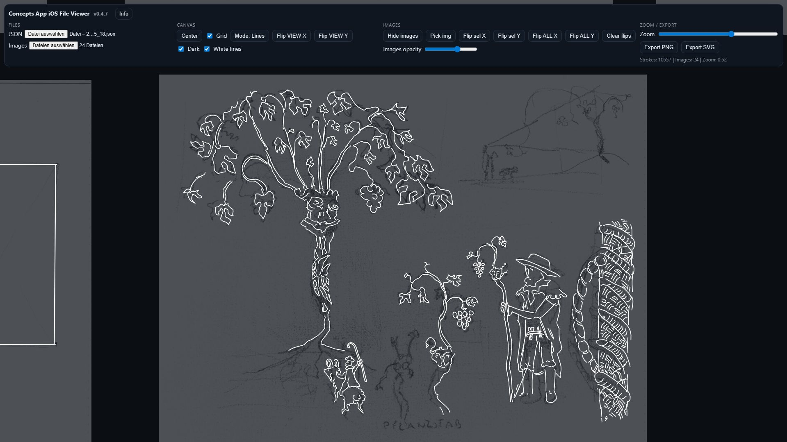

# ConceptsApp iOS WebViewer v0.5.0

👉 **[Live Demo](https://maxliebscher.github.io/ConceptsAppiOSFileViewer/)**  
👉 **[Download under Releases](../../releases)**  

> **Offline-first web viewer for Concepts (`.concept`) files.**  
> v0.5.0 adds full in-browser import — no external Python script required.

  
  
  

  
  
  

  

---

## ✨ Features (v0.5.0)

- **Auto-import `.concept`** — converts on load (no script needed).  
- **Cleaner UI/UX**  
  - Collapsable top bar  
  - Consistent section cards (light/dark)  
  - Files panel simplified; Advanced mode for JSON/Images  
  - Log panel (collapsible)  
- **Dark Mode + White lines** — grouped, toggleable  
- **PNG export** — @1×/2×/4× via offscreen canvas (auto filenames incl. version/zoom/mode)  
- **SVG export** — working again (experimental, see Known Gaps)  
- **ZIP download** — `name.zip` with `name.json` + generated `name_thumb.jpg`  
- **Persistence** — remembers Collapse, Advanced, Log open, Dark, White lines, Images opacity  
- **Keyboard shortcuts** — all listed in the Info modal  

---

## 🚀 Quick Start

1. **Open the viewer**  
   - `viewer/ConceptsViewer_0.5.0.html` in your browser  
   - or try the [Live Demo](https://maxliebscher.github.io/ConceptsAppiOSFileViewer/)

2. **Load data**  
   - Load a `.concept` file directly  
   - or load a converted `.json` (+ optional `images/`)

3. **Navigate / Export**  
   - Use **Center / Grid / Dark / White** controls  
   - Export via **PNG** (1×/2×/4×) or **SVG**  
   - Download ZIP for `.json` + thumb

4. **Diagnostics**  
   - Use the **Log drawer** for quick checks  

---

## 🧪 Try the Sample
- `samples/Demofile-3/Demofile-3.json` (ready to load)  
- Optional: open the matching `images/` .  
- The original `.concept` is included for comparison.  

---

## ⚠️ Known Gaps (v0.5.0)

- Embedded images inside `.concept` are not applied.  
- Manual loading of images from unpacked ZIP works only with `.json`, not `.concept`.  
- SVG export still experimental:  
  - Possible horizontal/vertical mirroring issues  
  - Stroke linecaps not rounded

---

## 🛣 Roadmap
- **0.5.x** — load embedded images in *.concept files, UI reset button  
- **0.6** — improve SVG export, extend brush dynamics & auto-shapes  

---

## 📜 Legal
This project is an **unofficial viewer** for content created with *Concepts* (TopHatch, Inc.).  
All artwork and trademarks belong to their respective owners.  

---

## 📦 License
MIT — see `LICENSE`.  

---

## 🗒 Changelog
See [`CHANGELOG.md`](CHANGELOG.md) for details on v0.5.0 and earlier.
